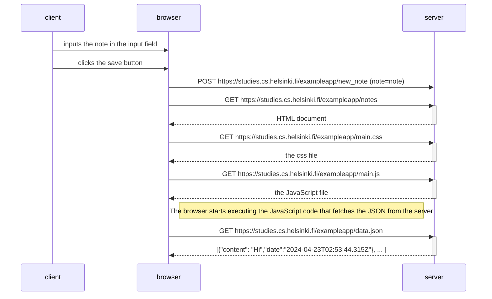

```mermaid
sequenceDiagram
    participant client
    participant browser
    participant server

    client->>browser: inputs the note in the input field
    client->>browser: clicks the save button

    browser->>server: POST https://studies.cs.helsinki.fi/exampleapp/new_note (note=note)
    browser->>server: GET https://studies.cs.helsinki.fi/exampleapp/notes
    activate server
    server-->>browser: HTML document
    deactivate server

    browser->>server: GET https://studies.cs.helsinki.fi/exampleapp/main.css
    activate server
    server-->>browser: the css file
    deactivate server

    browser->>server: GET https://studies.cs.helsinki.fi/exampleapp/main.js
    activate server
    server-->>browser: the JavaScript file
    deactivate server

    Note right of browser: The browser starts executing the JavaScript code that fetches the JSON from the server

    browser->>server: GET https://studies.cs.helsinki.fi/exampleapp/data.json
    activate server
    server-->>browser: [{"content": "Hi","date":"2024-04-23T02:53:44.315Z"}, ... ]
    deactivate server
```