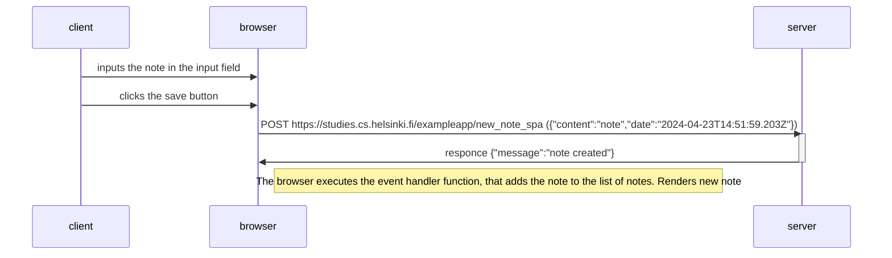

```mermaid
sequenceDiagram
    participant client
    participant browser
    participant server

    client->>browser: inputs the note in the input field
    client->>browser: clicks the save button

    browser->>server: POST https://studies.cs.helsinki.fi/exampleapp/new_note_spa ({"content":"note","date":"2024-04-23T14:51:59.203Z"})
    activate server
    server->>browser: responce {"message":"note created"}
    deactivate server

    Note right of browser: The browser executes the event handler function, that adds the note to the list of notes. Renders new note
```